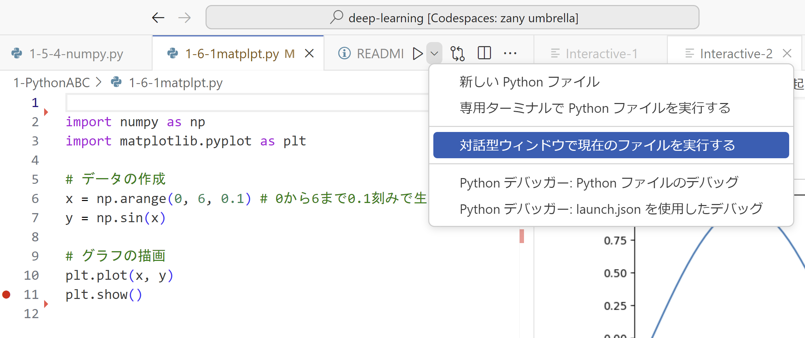

## Dictionary

```python
me = { 'key': 'value' }
me['key'] # 'value'
```

## if sentence

```python
if hungry:
    print("I'm hungry") # 空白文字によるインデント
else:
    print("I'm not hungry")
    print("I'm sleepy")
```

## for sentence

```python
for i in [1, 2, 3]:
    print(i)
```

## function

```python
def hello():
    print('hello')

hello()
```

```python
def hello(name):
    print('hello ' + name)

hello('cat')
```


## カーネルに接続して実行する

よくわからんが、カーネルに接続しないとグラフの描画ができないらしい。

`#%%` と書くことでコードブロックとなり（？）カーネルに接続した状態でコードを実行できるため、グラフの描画ができる（？）

それか `#%%` を書かないで対話型ウィンドウでの実行でも、同じくグラフの描画ができた。
